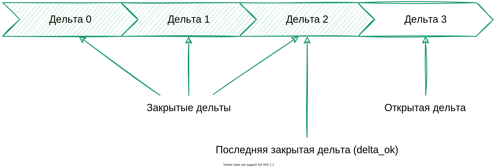

---
layout: default
title: Дельта
nav_order: 13
parent: Основные понятия
grand_parent: Обзор понятий, компонентов и связей
has_children: false
has_toc: false
---

# Дельта {#delta}

_Дельта_ — целостная совокупность изменений в [логической базе данных](../logical_db/logical_db.md). 
Дельта включает все [операции записи](../write_operation/write_operation.md), выполненные между открытием и 
закрытием этой дельты, и имеет порядковый номер, уникальный в рамках логической базы данных.

Нумерация дельт начинается с 0. Дельты, упорядоченные в порядке возрастания их номеров, формируют историю 
состояний данных логической БД.

На рисунке ниже показана последовательность операций записи, выполненных в дельтах 0 и 1. 
В дельте 0 выполнены операции записи с номерами 0-2, в дельте 1 — операции записи с номерами 3-4.

{: .figure-center}
*Операции записи двух дельт*
{: .figure-caption-center}

Дельту можно [открыть](../../../reference/sql_plus_requests/BEGIN_DELTA/BEGIN_DELTA.md), 
[закрыть](../../../reference/sql_plus_requests/COMMIT_DELTA/COMMIT_DELTA.md) и 
[отменить](../../../reference/sql_plus_requests/ROLLBACK_DELTA/ROLLBACK_DELTA.md) (откатить). 
Дельта, которая была открыта и еще не была закрыта, содержит горячие записи и называется открытой 
или горячей. Для каждой логической базы данных одновременно может быть открыто не более одной дельты. 
Дельта, которая была закрыта (зафиксирована), содержит актуальные и архивные записи и называется закрытой.

На рисунке ниже показана последовательность дельт, где дельта с номером 3 является открытой, а все 
предыдущие — закрытыми.

{:height="70%" width="70%"}
{: .figure-center}
*Открытая и закрытые дельты*
{: .figure-caption-center}

Чтобы добавить или изменить данные логической БД, нужно открыть дельту, внести изменения в требуемые логические 
таблицы и затем зафиксировать изменения (закрыть дельту). Количество изменений в одной дельте не ограничено. 
Вносить изменения в таблицы можно с помощью [загрузки](../../../working_with_system/data_upload/data_upload.md), 
[обновления данных](../../../working_with_system/data_update/data_update.md) или их сочетания.

Пока дельта открыта, создание, удаление и изменение таблиц и представлений в логической БД недоступно.
{: .note-wrapper}

Дельта должна содержать непротиворечивые данные о состоянии объектов: каждая добавляемая запись таблицы должна иметь 
уникальный первичный ключ. Если в одной горячей дельте в таблицу добавляются разные записи с одинаковым первичным ключом, 
система не гарантирует сохранение определенной записи. Исключение — полные дубликаты записи, из которых система 
сохраняет только один экземпляр. 

Информацию о разных состояниях одного объекта необходимо разделять по разным дельтам, как показано в примере на рисунке 
[ниже](#img_data_update). В примере показано изменение данных магазина, сменившего адрес. Первоначальные данные 
добавлены в рамках дельты 0, а новые данные — в рамках дельты 1.

{:height="90%" width="90%"}
{: .figure-center}
*Изменение данных магазина, сменившего адрес*
{: .figure-caption-center}

Если нужно вернуть состояние данных, которое предшествовало изменениям открытой 
дельты, следует [откатить дельту](../../../reference/sql_plus_requests/ROLLBACK_DELTA/ROLLBACK_DELTA.md).
Откатить можно только открытую дельту: после закрытия дельты возврат к предыдущему состоянию данных невозможен.

Номер дельты можно указывать при запросе и выгрузке данных, чтобы 
[определить момент или период](../../../reference/sql_plus_requests/SELECT/SELECT.md#for_system_time), 
по состоянию на который запрашивается информация.