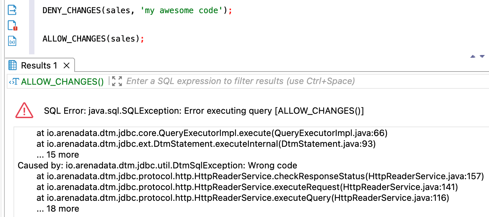

---
layout: default
title: ALLOW_CHANGES
nav_order: 1
parent: Запросы SQL+
grand_parent: Справочная информация
has_children: false
has_toc: false
---

# ALLOW_CHANGES

Запрос позволяет снять запрет на изменение логических сущностей, установленный запросом 
[DENY_CHANGES](../DENY_CHANGES/DENY_CHANGES.md). При успешном выполнении запроса становится доступно создание, 
удаление и изменение сущностей 
[логической базы данных](../../../overview/main_concepts/logical_db/logical_db.md):
* [логических таблиц](../../../overview/main_concepts/logical_table/logical_table.md),
* [логических представлений](../../../overview/main_concepts/logical_view/logical_view.md),
* [материализованных представлений](../../../overview/main_concepts/materialized_view/materialized_view.md). 

Если при установке запрета был указан код, его необходимо ввести для снятия запрета.

В ответе возвращается:
* пустой объект ResultSet при успешном выполнении запроса;
* исключение при неуспешном выполнении запроса.

## Синтаксис {#syntax}

```sql
ALLOW_CHANGES([db_name, ['code']])
```

Параметры:
* `db_name` — имя логической базы данных, для которой снимается запрет изменений. Опционально, если выбрана 
  логическая БД, [используемая по умолчанию](../../../working_with_system/other_features/default_db_set-up/default_db_set-up.md);
* `code` — код-пароль, заданный ранее в запросе [DENY_CHANGES](../DENY_CHANGES/DENY_CHANGES.md) при установке запрета 
  изменений.

## Ограничения {#restrictions}

Выполнение запроса недоступно при наличии незавершенного запроса на создание, удаление или изменение таблицы или 
представления.

## Примеры {#examples}

### Снятие запрета без кода {#examples_no_code}

Снятие запрета для указанной логической базы данных:

```sql
ALLOW_CHANGES(sales)
```

Снятие запрета для логической БД, выбранной по умолчанию:

```sql
ALLOW_CHANGES()
```

На рисунке ниже показан пример ответа на запрос `ALLOW_CHANGES` в случае некорректного код-пароля. При установке запрета
изменений был указан код `my awesome code`, который не был указан при снятии запрета.

{:height="80%" width="80%"}
{: .figure-center}
*Ответ ALLOW_CHANGES в случае некорректного кода*
{: .figure-caption-center}

### Снятие запрета с кодом {#examples_with_code}

Снятие запрета для указанной логической базы данных:

```sql
ALLOW_CHANGES(sales, 'my awesome code')
```

Снятие запрета для логической базы данных, выбранной по умолчанию:

```sql
ALLOW_CHANGES('любой код')
```