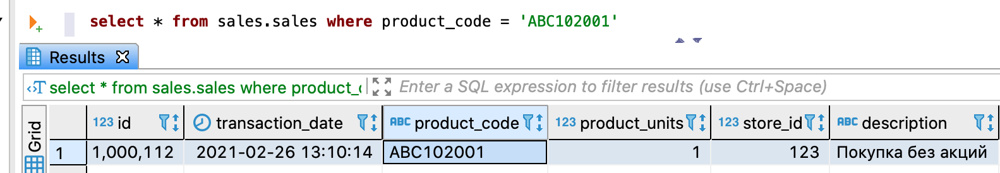

---
layout: default
title: Запрос данных
nav_order: 6
parent: Работа с системой
has_children: true
has_toc: false
---

# Запрос данных {#data_reading}

Система позволяет запрашивать небольшие объемы данных. Возможные способы выбора данных см. в секции 
[FOR SYSTEM_TIME](../../reference/sql_plus_requests/SELECT/SELECT.md#for_system_time) раздела [SELECT](../../reference/sql_plus_requests/SELECT/SELECT.md).

Под небольшим объемом данных подразумевается результат, содержащий десятки строк.
Для получения большого объема данных следует использовать [выгрузку данных](../data_download/data_download.md).
{: .note-wrapper}

Чтобы запросить данные из [логических таблиц](../../overview/main_concepts/logical_table/logical_table.md), 
[логических представлений](../../overview/main_concepts/logical_view/logical_view.md) 
или [материализованного представления](../../overview/main_concepts/materialized_view/materialized_view.md), 
выполните запрос [SELECT](../../reference/sql_plus_requests/SELECT/SELECT.md). В запросе можно указать СУБД хранилища 
для исполнения запроса, иначе, если СУБД не указана, система определяет 
[наиболее оптимальную СУБД для запроса](../data_reading/routing/routing.md).

Запрос обрабатывается в порядке, описанном в разделе 
[Порядок обработки запросов на чтение данных](../../overview/interactions/llr_processing/llr_processing.md). 
Успешный ответ содержит запрошенные данные, неуспешный — исключение.

На рисунке ниже показан пример запроса из логической таблицы `sales` с одной строкой в ответе.


{: .figure-center}
*Запрос небольшого объема данных*
{: .figure-caption-center}

## Примеры {#examples}

```sql
-- выбор логической базы данных sales в качестве базы данных по умолчанию
USE sales;

-- запрос данных из логической таблицы sales
SELECT s.store_id, SUM(s.product_units) AS product_amount
FROM sales AS s
GROUP BY (s.store_id)
ORDER BY product_amount DESC
LIMIT 20;

-- запрос данных из логического представления stores_by_sold_products
SELECT sold.store_id, sold.product_amount
FROM stores_by_sold_products AS sold;

-- запрос данных из материализованного представления sales_by_stores
SELECT * FROM sales_by_stores
WHERE store_id IN (1234, 1235, 1236);
```