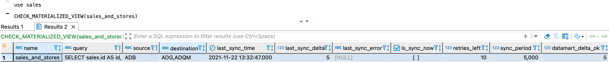
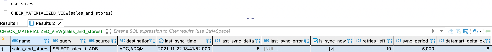

---
layout: default
title: CHECK_MATERIALIZED_VIEW
nav_order: 6
parent: Запросы SQL+
grand_parent: Справочная информация
has_children: false
has_toc: false
---

# CHECK_MATERIALIZED_VIEW

Запрос позволяет получить информацию по одному или всем 
[материализованным представлениям](../../../overview/main_concepts/materialized_view/materialized_view.md) 
[логической базы данных](../../../overview/main_concepts/logical_db/logical_db.md).

По каждому материализованному представлению доступна следующая информация:
* `name` — имя материализованного представления;
* `query` — [SELECT](../SELECT/SELECT.md)-запрос, который используется для синхронизации представления с источником;
* `source` — [СУБД](../../../introduction/supported_DBMS/supported_DBMS.md)
  [хранилища](../../../overview/main_concepts/data_storage/data_storage.md), которая служит источником данных представления;
* `destination` — список СУБД хранилища, в которых размещены данные представления. Возможные значения: adb, adqm;
* `last_sync_time` — дата и время последней синхронизации представления с СУБД-источником;
* `last_sync_delta` — номер последней [дельты](../../../overview/main_concepts/delta/delta.md) в представлении;
* `last_sync_error` — ошибка последней синхронизации представления, если такая ошибка была;
* `is_sync_now` — признак синхронизации представления в текущий момент. Возможные значения: флажок установлен, флажок снят;
* `retries_left` — количество оставшихся попыток синхронизации представления. Когда значение опускается до 0, система 
  перестает пытаться синхронизировать представление (до рестарта системы);
* `sync_period` — периодичность синхронизации представления (в миллисекундах);
* `datamart_delta_ok` — последняя закрытая дельта логической базы данных, в которой находится представление.

Успешный ответ содержит объект ResultSet, где каждая строка соответствует одному материализованному представлению, 
неуспешный ответ содержит исключение.

Подробнее о синхронизации представлений см. в разделе 
[Синхронизация материализованных представлений](../../../overview/main_concepts/materialized_view/materialized_view.md#synchronization).
{: .note-wrapper}

## Синтаксис {#syntax}

```sql
CHECK_MATERIALIZED_VIEW([[db_name.]materialized_view_name])
```

Параметры:
*   `db_name` — имя логической базы данных, в которой находится материализованное представление. Параметр
    опционален, если выбрана логическая БД, 
    [используемая по умолчанию](../../../working_with_system/other_features/default_db_set-up/default_db_set-up.md);
*   `materialized_view_name` — имя материализованного представления, по которому запрашивается информация.

## Примеры {#examples}

### Запрос информации по всем представлениям логической БД, выбранной по умолчанию {#all_views}

```sql
CHECK_MATERIALIZED_VIEW()
```

### Запрос информации по одному представлению {#one_view}

Запрос в логической БД, выбранной по умолчанию:

```sql
CHECK_MATERIALIZED_VIEW(sales_and_stores)
```

Запрос в указанной логической БД:

```sql
CHECK_MATERIALIZED_VIEW(sales.sales_and_stores)
```

На рисунках ниже показаны примеры ответов на запрос `CHECK_MATERIALIZED_VIEW`. На первом рисунке представление полностью 
синхронизовано с источником: в столбце `is_sync_now` нет флажка, и значения в столбцах `last_sync_delta` и 
`datamart_delta_ok` совпадают. На втором рисунке представление синхронизируется в текущий момент.


{: .figure-center}
*Пример ответа: представление синхронизировано с источником*
{: .figure-caption-center}


{: .figure-center}
*Пример ответа: представление еще синхронизируется с источником*
{: .figure-caption-center}