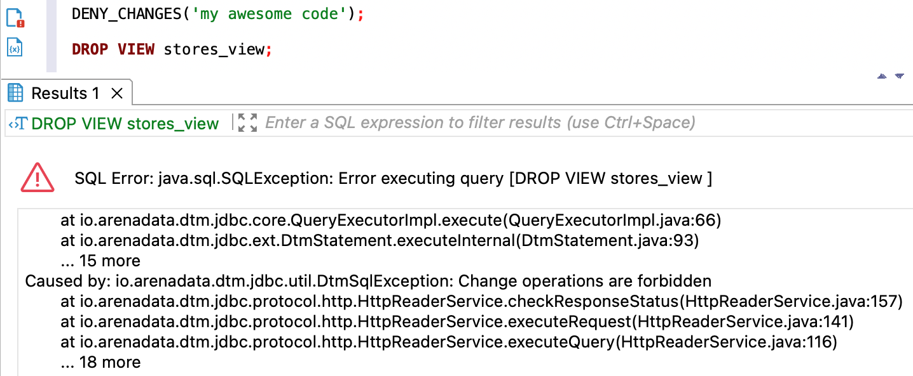

---
layout: default
title: DENY_CHANGES
nav_order: 20
parent: Запросы SQL+
grand_parent: Справочная информация
has_children: false
has_toc: false
---

# DENY_CHANGES

Запрос позволяет временно запретить создание, удаление и изменение сущностей 
[логической базы данных](../../../overview/main_concepts/logical_db/logical_db.md): 
* [логических таблиц](../../../overview/main_concepts/logical_table/logical_table.md),
* [логических представлений](../../../overview/main_concepts/logical_view/logical_view.md),
* [материализованных представлений](../../../overview/main_concepts/materialized_view/materialized_view.md). 

В запросе можно указать произвольный код, без которого снятие запрета будет невозможно. 
При установленном запрете остаются доступны все действия с данными:
[загрузка](../../../working_with_system/data_upload/data_upload.md), 
[обновление](../../../working_with_system/data_update/data_update.md), 
[чтение](../../../working_with_system/data_reading/data_reading.md) и 
[выгрузка](../../../working_with_system/data_download/data_download.md).

В ответе возвращается:
* пустой объект ResultSet при успешном выполнении запроса;
* исключение при неуспешном выполнении запроса.

Чтобы снять запрет на изменение сущностей, используйте запрос [ALLOW_CHANGES](../ALLOW_CHANGES/ALLOW_CHANGES.md).
{: .note-wrapper}

## Синтаксис {#syntax}

```sql
DENY_CHANGES([db_name, ['code']])
```

Параметры:
* `db_name` — имя логической базы данных, для которой устанавливается запрет изменений. Опциональный параметр, если выбрана 
  логическая БД, [используемая по умолчанию](../../../working_with_system/other_features/default_db_set-up/default_db_set-up.md);
* `code` — произвольный код-пароль, без которого будет невозможно снять запрет после установки. Опциональный параметр. 

## Ограничения {#restrictions}

Выполнение запроса недоступно при наличии другого запрета изменений или незавершенного запроса на создание, удаление 
или изменение таблицы или представления.

## Примеры {#examples}

### Установка запрета без кода {#examples_no_code}

Установка запрета для указанной логической базы данных:

```sql
DENY_CHANGES(sales)
```

Установка запрета для логической базы данных, выбранной по умолчанию:

```sql
DENY_CHANGES()
```

### Установка запрета с кодом {#examples_with_code}

Установка запрета для указанной логической базы данных:

```sql
DENY_CHANGES(sales, 'my awesome code')
```

Установка запрета для логической базы данных, выбранной по умолчанию:

```sql
DENY_CHANGES('любой код')
```

На рисунке ниже показан пример ответа на запрос `DROP VIEW` после установки запрета изменений с помощью `DENY_CHANGES`. 
В ответе возвращается ошибка, поясняющая, что изменение логических сущностей запрещено.

{:height="80%" width="80%"}
{: .figure-center}
*Ответ на запрос удаления представления после установки запрета изменений*
{: .figure-caption-center}