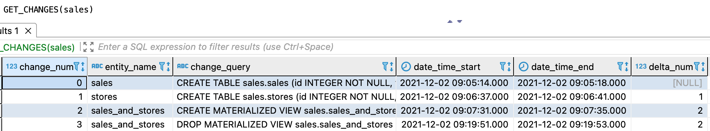

---
layout: default
title: GET_CHANGES
nav_order: 27
parent: Запросы SQL+
grand_parent: Справочная информация
has_children: false
has_toc: false
---

# GET_CHANGES

Запрос позволяет получить содержимое [журнала](../../../overview/main_concepts/changelog/changelog.md) — список всех 
операций по изменению сущностей в [логической базе данных](../../../overview/main_concepts/logical_db/logical_db.md).

Журнал ведется в системе, начиная с версии 5.3. Изменения, выполненные в более ранних версиях, в журнале отсутствуют.
<br>Для логических базы данных, которые создавались и изменялись только до версии 5.3, запрос `GET_CHANGES` 
возвращает ошибку.
{: .note-wrapper}

По каждой операции доступна следующая информация:
* `change_num` — номер операции. Нумерация ведется в рамках логической базы данных;
* `entity_name` — имя логической сущности;
* `change_query` — содержимое запроса на изменение логической сущности;
* `start_time` — дата и время начала выполнения запроса `change_query`;
* `end_time` — дата и время окончания выполнения запроса `change_query`. Если поле пустое, это означает, что операция 
  еще не завершена;
* `delta_num` — последняя закрытая дельта в логической базе данных на момент запроса информации. Если закрытых дельт еще 
  нет, поле имеет пустое значение. 

Успешный ответ содержит объект ResultSet, где каждая строка соответствует одной операции, неуспешный ответ содержит 
исключение.

## Синтаксис {#syntax}

```sql
GET_CHANGES([db_name])
```

Параметры:
* `db_name` — имя логической базы данных, для которой запрашивается журнал. Опционально, если выбрана логическая БД, 
  [используемая по умолчанию](../../../working_with_system/other_features/default_db_set-up/default_db_set-up.md).

## Примеры {#examples}

Запрос журнала для указанной логической базы данных:

```sql
GET_CHANGES(sales)
```

Запрос журнала для логической базы данных, выбранной по умолчанию:

```sql
-- выбор логической базы данных sales в качестве базы данных по умолчанию
USE sales;

-- запрос журнала для sales
GET_CHANGES();
```

На рисунке ниже показан пример ответа на запрос `GET_CHANGES`. Ответ содержит информацию о двух созданных таблицах, а
также об одном материализованном представлении, которое было создано, а затем удалено.


{: .figure-center}
*Ответ GET_CHANGES*
{: .figure-caption-center}
