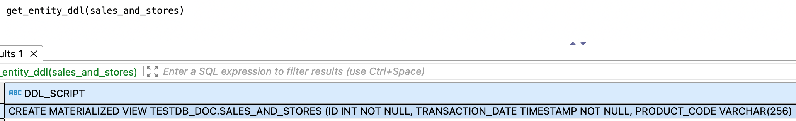

---
layout: default
title: GET_ENTITY_DDL
nav_order: 32
parent: Запросы SQL+
grand_parent: Справочная информация
has_children: false
has_toc: false
---

# GET_ENTITY_DDL

Запрос позволяет получить содержимое запроса на создание логической сущности в текущем состоянии. 
Информацию можно получить по следующим логическим сущностям: 
* [логической таблице](../../../overview/main_concepts/logical_table/logical_table.md),
* [логическому представлению](../../../overview/main_concepts/logical_view/logical_view.md),
* [материализованному представлению](../../../overview/main_concepts/materialized_view/materialized_view.md).

Успешный ответ содержит объект ResultSet с одной строкой, в которой представлен запрос на создание сущности. 
Неуспешный ответ содержит исключение.

## Синтаксис {#syntax}

```sql
GET_ENTITY_DDL([db_name.]entity_name)
```

Параметры:
* `db_name` — имя логической базы данных, которой принадлежит запрашиваемая сущность. Опционально, если выбрана 
  логическая БД, [используемая по умолчанию](../../../working_with_system/other_features/default_db_set-up/default_db_set-up.md);
* `entity_name` — имя таблицы или представления, по которому запрашивается информация.

## Примеры {#examples}

### Запрос по сущности указанной логической БД {#example_for_defined_db}

```sql
GET_ENTITY_DDL(sales.stores)
```

### Запрос по сущности логической БД, выбранной по умолчанию {#example_for_default_db}

```sql
-- выбор логической базы данных sales в качестве базы данных по умолчанию
USE sales;

-- запрос информации по представлению sales_and_stores
GET_ENTITY_DDL(sales_and_stores);
```

На рисунке ниже показан фрагмент ответа на запрос `GET_ENTITY_DDL` по материализованному представлению `sales_and_stores`.


{: .figure-center}
*Фрагмент ответа на запрос GET_ENTITY_DDL*
{: .figure-caption-center}