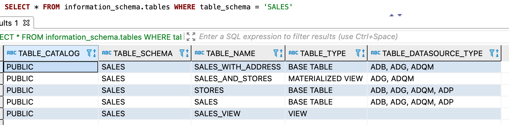

---
layout: default
title: Проверка месторасположения логической сущности
nav_order: 3
parent: Другие действия
grand_parent: Работа с системой
has_children: false
has_toc: false
---

# Проверка месторасположения логической сущности {#datasource_check}

Чтобы проверить, в каких [СУБД](../../../introduction/supported_DBMS/supported_DBMS.md)
[хранилища](../../../overview/main_concepts/data_storage/data_storage.md) размещены данные 
[логической таблицы](../../../overview/main_concepts/logical_table/logical_table.md) или 
[материализованного представления](../../../overview/main_concepts/materialized_view/materialized_view.md), 
выполните запрос к системному представлению [tables](../../../reference/system_views/system_views.md#tables) 
(вместо `DB_NAME` и `ENTITY_NAME` подставьте имя логической базы данных и имя
таблицы или представления в верхнем регистре):
* запрос для логической таблицы:
```sql
SELECT * FROM information_schema.tables
WHERE table_schema = '<DB_NAME>' AND (table_name = '<ENTITY_NAME>' AND table_type = 'BASE TABLE')
```
* запрос для материализованного представления:
```sql
SELECT * FROM information_schema.tables
WHERE table_schema = '<DB_NAME>' AND (table_name = '<ENTITY_NAME>' AND table_type = 'MATERIALIZED VIEW')
```

В ответе система возвращает информацию о запрошенной логической сущности, где столбец `table_datasource_type` 
содержит список СУБД хранилища, в которых размещены данные логической сущности.

На рисунке ниже показан пример запроса по **всем** логическим сущностям логической БД `sales`.

<a id="img_datasource_check"></a>

{: .figure-center}
*Системное представление tables*
{: .figure-caption-center}